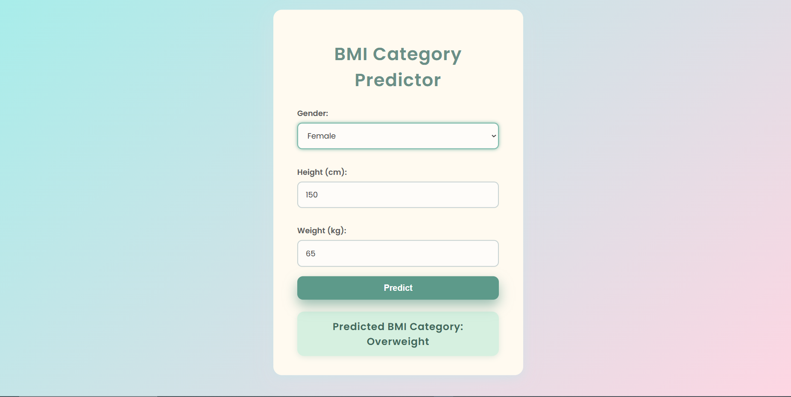

# 🚀 BMI Category Predictor

A full-stack application built with **Python**, **Flask**, and **machine learning** to predict BMI categories based on user input.

---

## 🧠 Technologies Used
- **Python Libraries:** scikit-learn, pandas, numpy, joblib, Flask  
- **Dataset:** Kaggle’s "500 Person Gender-Height-Weight-Body Mass Index" dataset 📊  
- **Frontend:** HTML, CSS, and JavaScript for a clean and responsive user interface 🎨

---

## 🔍 Project Overview
This app processes user data to predict BMI categories using classification models trained on real-world data. It showcases skills in:  
- Data preprocessing and feature engineering  
- Building and training machine learning models  
- Creating RESTful APIs with Flask  
- Integrating frontend and backend for smooth user experience  

---
## 🎨 Design Preview

**Design Files:** See [`Designs`](designs/) folder in this repository. 

---

## 🎥 Preview Images

 

---

## 🛠 Skills & Tools

### Programming Languages & Frameworks
- Python  
- Flask (Backend API development)  
- JavaScript, HTML, CSS (Frontend design)

### Machine Learning & Data Processing
- scikit-learn (Model building and evaluation)  
- pandas & numpy (Data manipulation and preprocessing)  
- joblib (Model serialization)

### Tools & Platforms
- VS Code - (Code editor)  
- Kaggle - (Dataset sourcing)  
- Git & GitHub - (Version control and project hosting) 

---

